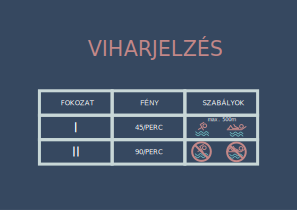

# [Középszintű digitális kultúra érettségi - 2023. május 15. 8:00](feladatsor.pdf)

### [Eredmény:](eredmeny.pdf) 98% (139/141)


## 1. Ikarus
#### [word](ikarus.docx)


## 2. Viharjelzés



## 3. Pénzfeldobás
#### 2. Hozzon létre az A3:B102 tartományban egy 100 dobásból álló dobássorozat eredményét mutató sorozatot az alábbiak szerint!
```
b)  =HA(VÉLETLEN.KÖZÖTT(0;1) = 0;"Fej";"Írás")
```

#### 3. A továbbiakban azt vizsgáljuk, hogy milyen hosszúak voltak a sorozat azon részei, ahol egymás után azonos „Fej” vagy „Írás” szavak szerepeltek. Ehhez az alábbiak szerint adja meg a C3:C102 tartományban, hogy az adott sorban a B oszlopban álló dobás eredménye azonos-e az előző dobás eredményével! 
```
c)  =HA(B4=B3;"Igen";"")
```

#### 4. Az D3:D102 tartományban az alábbiak szerint adja meg, hogy az adott sorban a B oszlopban álló szó a felette lévő azonos szavakkal milyen hosszú részsorozatot alkot!
```
c) =HA(C4="Igen";D3+1;1)
```

#### 5. Az F2-es cellába helyezze el vagy írja be a „Dobás” szót, és az F3:G4 tartomány celláiban helyezze el a minta szerint a „Fej” és „Írás” szövegeket, és mellettük adja meg, hogy a sorozatban hány fej, illetve hány írás eredmény szerepel!
```
=DARABHATÖBB($B$3:$B$102;F3)
```

#### 6. Az  F6:F10  tartomány  celláiba  a  minta  szerint  helyezze  el  a  „Leghosszabb  azonos”, „hossza”, „vége”, „eleje”, „dobás” szövegeket! A G7:G10 tartomány celláiba rendre adja meg képlet segítségével, hogy a dobássorozatban
```
a)  =MAX(D3:D102)

b)  =HOL.VAN(G7;D1:D112;0)

c)  =G8-(G7-1)
```


## 4. Kutyaaktivitás
#### 2. Lekérdezés segítségével listázza ki ábécérendben az ivartalanított szukák nevét! (2szuka)
```sql
SELECT nev
FROM kutya
WHERE ivartalanitott = True AND kan = False;
```
#### 3. Készítsen lekérdezést, amely megadja azon kutyák nevét, amelyeknél volt olyan nap, hogy alvásukat legfeljebb 80 ponttal értékelte a mérő, és ugyanezen nap rázás vagy vakarózás miatt is figyelmeztetett! Minden kutya neve egyszer jelenjen meg! (3figyelmeztetes)
```sql
SELECT DISTINCT nev
FROM kutya INNER JOIN aktivitas ON kutya.id = aktivitas.kutyaid
WHERE (razas=True AND alvas<=80) OR (alvas<=80 AND vakarozas=True);
```
#### 4. Készítsen lekérdezést, amely megadja, hogy a „.Husi” nevű kutya hány augusztusi napon használt fel több energiát a normális táplálás melletti napi energiaigényénél! (4Husi)
```sql
SELECT COUNT(*)
FROM aktivitas INNER JOIN kutya ON aktivitas.kutyaid = kutya.id
WHERE nev="Husi" AND datum >= #8/1/2022# AND datum < #9/1/2022# AND kutya.kaloria < aktivitas.kaloria;
```
#### 5. Készítsen lekérdezést, amely megadja, hogy melyik kutyán kezdték legutoljára használni az aktivitásmérőt! Jelenítse meg a kutya nevét és az első használat dátumát! (5utoljara)
```sql
SELECT TOP 1 nev, MIN(datum)
FROM aktivitas INNER JOIN kutya ON aktivitas.kutyaid = kutya.id
GROUP BY nev
ORDER BY MIN(datum) DESC;
```


## 5. Kitaláló
```cs
using System;
using System.Collections.Generic;
using System.Linq;
using System.Text;
using System.Threading.Tasks;

namespace kitalalo
{
    internal class kitalalo
    {
        static void Main(string[] args)
        {
            string s = "fuvola csirke adatok asztal fogoly bicska farkas almafa babona gerinc dervis bagoly ecetes angyal boglya";
            string[] szavak = s.Split();
            Random r = new Random();
            string rejtett, tipp, eredmeny ="";
            int tippcount = 0;

            rejtett = szavak[r.Next(0,szavak.Length)];

            do
            {
                Console.Write("Kérem a tippet: ");
                tipp = Console.ReadLine();

                if(tipp != "stop")
                {
                    for (int i = 0; i < 6; i++)
                        if (tipp[i] == rejtett[i])
                            eredmeny += rejtett[i];
                        else
                            eredmeny += ".";

                    Console.WriteLine($"Az eredmény: {eredmeny}\n");
                    tippcount++;
                    eredmeny = "";
                }

            } while (tipp != "stop" && tipp != rejtett);
            
            if (tipp != "stop")
                Console.WriteLine($"{tippcount} tippeléssel sikerült kitalálni.");
            Console.ReadLine();
        }
    }
}
```